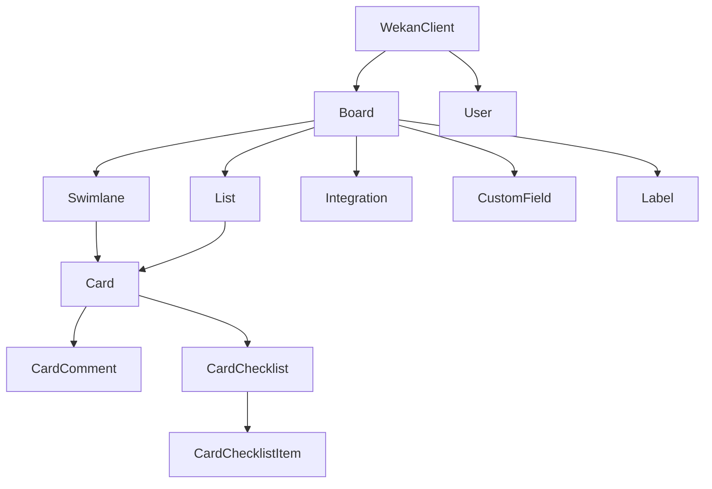

# python-wekan
This is a python client for interacting with the [WeKan®](https://github.com/wekan/wekan) REST-API.
Each WeKan object is represented by a corresponding python object.

For further details about the [WeKan® API](https://wekan.github.io/api) consider the official documentation.

## Installation
The project assumes that you are using a [currently-supported](https://devguide.python.org/versions/) version of Python, which is 3.9+ at the time of writing.

### From OS Packaging
[](https://repology.org/project/python:wekan/versions)

### Via pip
```bash
# Install library only
pip install python-wekan

# Install with CLI support
pip install python-wekan[cli]
```

## How to use
### Set the credentials
```bash
export WEKAN_USERNAME="USERNAME"
export WEKAN_PASSWORD="PASSWORD" # pragma: allowlist secret
```
### Use the module
```python
import os
from wekan import WekanClient


if __name__ == '__main__':
    wekan = WekanClient(
        base_url='https://your_wekan_instance.com',
        username=os.getenv('WEKAN_USERNAME'),
        password=os.getenv('WEKAN_PASSWORD'))

    boards = wekan.list_boards()
    for board in boards:
        print(board.title)
```

### Dependencies between the wekan python objects
There are dependencies between objects.

This visualisation shows the dependencies between different objects.


Example:
If you want to fetch the cards within a list, you need to get the board and the list object first.

## Examples
### Add a new board
```python
import os
from wekan import WekanClient


wekan = WekanClient(
    base_url='https://your_wekan_instance.com',
    username=os.getenv('WEKAN_USERNAME'),
    password=os.getenv('WEKAN_PASSWORD'))

new_board = wekan.add_board(
    title="My new Board",
    color="midnight",
    is_admin=True,
    is_no_comments=False,
    is_comment_only=False)
print(new_board.created_at)
```
### Create a new list
```python
import os
from wekan import WekanClient


wekan = WekanClient(
    base_url='https://your_wekan_instance.com',
    username=os.getenv('WEKAN_USERNAME'),
    password=os.getenv('WEKAN_PASSWORD'))

board = wekan.list_boards(regex_filter='My new Board')[0]
board.add_list(title="My first list")
board.add_list(title="My second list")
```
### Create a new card
```python
import os
from wekan import WekanClient


wekan = WekanClient(
    base_url='https://your_wekan_instance.com',
    username=os.getenv('WEKAN_USERNAME'),
    password=os.getenv('WEKAN_PASSWORD'))

board = wekan.list_boards(regex_filter='My new Board')[0]
wekan_list = board.list_lists(regex_filter="My first list")[0]
swimlane = board.list_swimlanes()[0]
wekan_list.add_card(
    title="My first card",
    swimlane=swimlane,
    description="My first description")
```
### Move card between lists
```python
import os
from wekan import WekanClient


wekan = WekanClient(
    base_url='https://your_wekan_instance.com',
    username=os.getenv('WEKAN_USERNAME'),
    password=os.getenv('WEKAN_PASSWORD'))

board = wekan.list_boards(regex_filter='My new Board')[0]
src_list = board.list_lists(regex_filter="My first list")[0]
dst_list = board.list_lists(regex_filter="My second list")[0]
card = src_list.list_cards(regex_filter="My first card")[0]
card.edit(new_list=dst_list)
```

### Create a new swimlane
```python
import os
from wekan import WekanClient


wekan = WekanClient(
    base_url='https://your_wekan_instance.com',
    username=os.getenv('WEKAN_USERNAME'),
    password=os.getenv('WEKAN_PASSWORD'))

board = wekan.list_boards(regex_filter='My new Board')[0]
board.add_swimlane(title="My first swimlane")
```

## Command Line Interface

The python-wekan library includes a comprehensive CLI with modern features for managing WeKan boards from the command line.

### Installation
```bash
pip install python-wekan[cli]
```

### Quick Start
```bash
# Initialize configuration
wekan config init https://your-wekan-server.com username password

# Check connection status
wekan status

# Start interactive navigation shell (recommended!)
wekan navigate
```

### Interactive Navigation Shell
The CLI features a powerful **filesystem-like navigation** interface that lets you browse and manage your WeKan boards intuitively:

```bash
# Start the navigation shell
wekan navigate

# Navigate through your boards, lists, and cards like directories
wekan> ls                    # List all boards
wekan> cd "My Project"       # Enter a board
wekan:/My Project> ls        # List board contents (lists, swimlanes)
wekan:/My Project> cd Todo   # Enter a list
wekan:/My Project/Todo> ls   # List cards in the list
wekan:/My Project/Todo> cd 1 # Enter a card by index or ID
wekan:/My Project/Todo/1> edit # Edit card properties

# Navigation commands
pwd                          # Show current path
cd ..                        # Go up one level
cd /                         # Go to root (all boards)
history                      # Show command history
help                         # Show available commands
exit                         # Exit navigation shell
```

### Standard Commands
Beyond the interactive shell, these commands are available:

#### Board Management
```bash
# List boards
wekan boards list

# Show board details
wekan boards show <board-id>

# Create a new board
wekan boards create "My Project Board" --description "Project management board"
```

#### Authentication & Configuration
```bash
# Authentication
wekan auth login             # Login with credentials
wekan auth whoami           # Show current user
wekan auth logout           # Clear stored credentials

# Configuration management
wekan config init <url> <username> <password>  # Initialize configuration
wekan config show                               # Show current configuration
wekan config set <key> <value>                 # Set configuration value
```

#### Utility Commands
```bash
wekan status                # Show connection status and server info
wekan version              # Show CLI version information
```

#### Filesystem Cloning & Sync
```bash
# Clone using configured credentials (.wekan file)
wekan clone configured                              # Clone all boards
wekan clone configured --board "Project Alpha"     # Clone specific board
wekan clone configured --board 0                   # Clone first board
wekan clone configured --output ~/backups          # Clone to custom directory

# Clone with explicit credentials
wekan clone host https://wekan.example.com username password
wekan clone host https://wekan.example.com username password --board "Project Alpha"
wekan clone host https://wekan.example.com username password --board 64a1b2c3d4e5f6789012345
wekan clone host https://wekan.example.com username password --board 0

# Clone to custom directory
wekan clone host https://wekan.example.com username password --output ~/my-wekan-backups

# List cloned repositories
wekan clone list
wekan clone list ~/my-wekan-backups

# Push/Sync changes back to WeKan server
wekan push status                                   # Show what changes need syncing (like git status)
wekan push status ./AI_Engineering                 # Check status for specific board
wekan push board                                    # Push current directory changes
wekan push board ./AI_Engineering                  # Push specific board changes
wekan push board --dry-run                         # Preview changes without applying
wekan push board --force                           # Skip confirmation prompt
wekan push diff                                     # Show detailed differences
```

The filesystem representation follows this structure:
```
wekan-repos/
├── example.com:8080/              # Host directory
│   ├── .wekan-host/              # Host metadata & config
│   ├── project-alpha/            # Board directory
│   │   ├── .wekan-board/         # Board metadata, labels, etc.
│   │   ├── backlog/              # List directory
│   │   │   ├── .wekan-list/      # List metadata
│   │   │   ├── story-001.md      # Card as markdown file
│   │   │   └── bug-fix-auth.md
│   │   └── done/
│   └── marketing-board/
```

Each card is stored as a markdown file with YAML frontmatter containing metadata:
```markdown
---
id: 64a1b2c3d4e5f6789012350
title: Implement user authentication
labels: [authentication, backend, high-priority]
members: [alice.dev, bob.backend]
due_at: 2025-01-20T17:00:00Z
---

# Implement user authentication

## Description
Create robust user authentication with login/logout...

## Checklists
### Technical Tasks
- [x] Database schema design
- [ ] API endpoints creation
```

#### Complete Git-like Workflow
The filesystem representation enables a complete git-like workflow for your kanban boards:

```bash
# 1. Clone your WeKan boards to local filesystem
wekan clone configured --output ~/my-project

# 2. Edit your tasks offline using your favorite text editor
cd ~/my-project/wekan.example.com/AI_Engineering/
vim Backlog/001-implement-auth.md

# 3. Check what changes you made
wekan push status
# Output: Found 1 change to sync:
#   ✏️ 1 card(s) to update:
#     • "Implement user authentication"

# 4. Preview the exact changes
wekan push diff

# 5. Push changes back to WeKan server
wekan push board
# Confirms and syncs your changes back to the server

# 6. Optional: Commit to git for version control
git add .
git commit -m "Updated authentication task requirements"
```

This workflow enables:
- **Offline editing** of your kanban boards
- **Version control** of project management data
- **Integration with git hooks** for automated synchronization
- **Collaborative editing** through standard git workflows
- **Backup and restore** capabilities through git repositories

#### Advanced Integration Possibilities

This bidirectional sync opens up powerful new paradigms for software development:

**🔄 Administration-Code Alignment**
- Keep project administration **in sync with code** under the same version control system
- Link commits, branches, and releases directly to their corresponding tasks and user stories
- Ensure project management data evolves alongside the codebase it describes

**👥 Cross-Functional Collaboration**
- **Management participation**: Managers can directly edit tasks, priorities, and requirements using familiar text editors
- **Developer engagement**: Developers can update task status, add technical notes, and refine requirements during implementation
- **Unified workflow**: Both technical and non-technical team members work within the same version-controlled environment

**📚 Integrated Documentation Ecosystem**
The filesystem representation enables linking project administration with comprehensive documentation:

```bash
my-project/
├── src/                           # Source code
├── docs/
│   ├── requirements/              # Requirements documentation
│   ├── use-cases/                # Use case specifications
│   └── test-strategy/            # Testing strategies
├── wekan-boards/                 # Project administration
│   ├── Product-Backlog/          # User stories and features
│   ├── Sprint-Planning/          # Sprint tasks and assignments
│   └── QA-Testing/              # Test cases and bug reports
└── README.md
```

**🔗 Traceability & Linking**
- **Requirements ↔ Tasks**: Link requirement documents directly to implementation tasks
- **Use Cases ↔ Stories**: Connect use case specifications to user stories and acceptance criteria
- **Test Strategy ↔ QA Tasks**: Bind testing strategies to specific QA tasks and test cases
- **Code ↔ Administration**: Reference specific commits, pull requests, and code changes from task descriptions

**⚡ Advanced Workflows**

*Git Hooks Integration*:
```bash
# Pre-commit hook: Validate task status matches code changes
# Post-commit hook: Auto-update task progress based on commit messages
# Pre-push hook: Ensure all tasks are properly documented before deployment
```

*Branch-Based Task Management*:
```bash
# Create feature branch with associated task updates
git checkout -b feature/user-auth
wekan push board  # Sync updated task status to "In Progress"

# On merge to main
git merge feature/user-auth
wekan push board  # Auto-move tasks to "Done" status
```

*Release Coordination*:
```bash
# Tag releases with synchronized project state
git tag v1.2.0
wekan clone configured --output releases/v1.2.0/  # Snapshot project state
```

**🎯 Benefits for Different Roles**

- **Project Managers**: Edit priorities and requirements in familiar editors, track changes through git history
- **Product Owners**: Collaborate on user stories and acceptance criteria using standard development workflows
- **Developers**: Update technical implementation details and progress without leaving their development environment
- **QA Engineers**: Maintain test cases and bug reports alongside code and documentation
- **Technical Writers**: Keep documentation synchronized with both code changes and administrative decisions

This creates a **unified source of truth** where code, administration, documentation, and project management all live under the same version control system, enabling unprecedented traceability and collaboration across all aspects of software development.

**Note**: The default `wekan-repos/` directory is automatically added to `.gitignore` to prevent cloned WeKan data from being committed to your project repositories.

### Configuration
The CLI supports multiple configuration methods:

#### Configuration File (`.wekan`)
The CLI automatically searches for `.wekan` configuration files in:
- Current directory
- Parent directories (up to home directory)
- Home directory (`~/.wekan`)

Example `.wekan` file:
```ini
[default]
base_url = https://your-wekan-server.com
username = your-username
password = your-password
```

#### Environment Variables
```bash
export WEKAN_BASE_URL=https://your-wekan-server.com
export WEKAN_USERNAME=your-username
export WEKAN_PASSWORD=your-password
```

### Features
- **Modern CLI Framework**: Built with typer and rich for beautiful output
- **Interactive Navigation**: Filesystem-like cd/ls/pwd interface
- **Command History**: Built-in command history and tab completion
- **Hierarchical Context**: Navigate through boards → lists → cards seamlessly
- **Card Editing**: Comprehensive card editing interface with date, member, label support
- **Configuration Management**: Flexible configuration via files or environment variables
- **Error Handling**: Improved error handling and user-friendly messages
- **Filesystem Cloning**: Clone WeKan boards to local filesystem as markdown files
- **Bidirectional Sync**: Push filesystem changes back to WeKan server
- **Git-like Workflow**: Complete version control workflow (clone, status, diff, push) for kanban boards
- **Content-based Change Detection**: Smart detection of actual content changes, not just timestamps
- **Safe Operations**: Dry-run mode and confirmation prompts prevent accidental changes

## Development
### Generate requirements
```bash
pipenv requirements > requirements.txt
pipenv requirements --dev-only > requirements_dev.txt
 ```

## credits
This project is based on [py-trello](https://github.com/sarumont/py-trello).
Some methods and design structures have been adopted 1:1.
