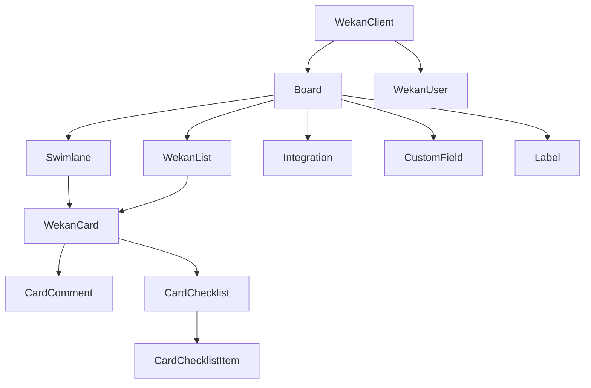

# python-wekan
This is a python client for interacting with the [WeKan®](https://github.com/wekan/wekan) REST-API.
Each WeKan object is represented by a corresponding python object.

For further details about the [WeKan® API](https://wekan.github.io/api) consider the official documentation.

## Installation
```bash
pip install python-wekan
```

## how to use
### Set the credentials
```bash
export WEKAN_USERNAME="USERNAME"
export WEKAN_PASSWORD="PASSWORD" 
```
### Use the module
```python
import os
from wekan import WekanClient


if __name__ == '__main__':
    wekan = WekanClient(base_url='https://your_wekan_instance.com',
                        username=os.getenv('WEKAN_USERNAME'),
                        password=os.getenv('WEKAN_PASSWORD'))
    
    boards = wekan.list_boards()
    for board in boards:
        print(board.title)
```

### Dependencies between the wekan python objects
There are dependencies between objects.

This visualisation shows the dependencies between different objects.


```mermaid
  graph TD;
      WekanClient-->Board;
      WekanClient-->WekanUser;
      Board-->WekanList;
      Board-->Swimlane;
      Swimlane-->WekanCard;
      Board-->Integration;
      Board-->CustomField;
      Board-->Label;
      WekanList-->WekanCard;
      WekanCard-->CardComment;
      WekanCard-->CardChecklist;
      CardChecklist-->CardChecklistItem;
```
Example:
If you want to fetch the cards within a list, you need to get the board and the list object first.

## Examples
### Add a new board
```python
import os
from wekan import WekanClient


wekan = WekanClient(base_url='https://your_wekan_instance.com',
                    username=os.getenv('WEKAN_USERNAME'),
                    password=os.getenv('WEKAN_PASSWORD'))

new_board = wekan.add_board(title="My new Board",
                            color="midnight")
print(new_board.created_at)
```
### Create a new list
```python
import os
from wekan import WekanClient


wekan = WekanClient(base_url='https://your_wekan_instance.com',
                    username=os.getenv('WEKAN_USERNAME'),
                    password=os.getenv('WEKAN_PASSWORD'))

board = wekan.list_boards(regex_filter='My new Board')[0]
board.create_list(title="My first list")
board.create_list(title="My second list")
```
### Create a new card
```python
import os
from wekan import WekanClient


wekan = WekanClient(base_url='https://your_wekan_instance.com',
                    username=os.getenv('WEKAN_USERNAME'),
                    password=os.getenv('WEKAN_PASSWORD'))

board = wekan.list_boards(regex_filter='My new Board')[0]
wekan_list = board.get_lists(regex_filter="My first list")[0]
wekan_list.create_card(title="My first card",
                       description="My first description")
```
### Move card between lists
```python
import os
from wekan import WekanClient


wekan = WekanClient(base_url='https://your_wekan_instance.com',
                    username=os.getenv('WEKAN_USERNAME'),
                    password=os.getenv('WEKAN_PASSWORD'))

board = wekan.list_boards(regex_filter='My new Board')[0]
src_list = board.get_lists(regex_filter="My first list")[0]
dst_list = board.get_lists(regex_filter="My second list")[0]
card = src_list.get_cards(regex_filter="My first card")[0]
card.move_to_list(dst_list)
```

### Update a Board
```python
import os
from wekan import WekanClient


wekan = WekanClient(base_url='https://your_wekan_instance.com',
                    username=os.getenv('WEKAN_USERNAME'),
                    password=os.getenv('WEKAN_PASSWORD'))

board = wekan.list_boards(regex_filter='My new Board')[0]
board.update(title="My updated board title")
```

### Archive a List
```python
import os
from wekan import WekanClient


wekan = WekanClient(base_url='https://your_wekan_instance.com',
                    username=os.getenv('WEKAN_USERNAME'),
                    password=os.getenv('WEKAN_PASSWORD'))

board = wekan.list_boards(regex_filter='My new Board')[0]
wekan_list = board.get_lists(regex_filter="My second list")[0]
wekan_list.archive()
```

### Create a new swimlane
```python
import os
from wekan import WekanClient


wekan = WekanClient(base_url='https://your_wekan_instance.com',
                    username=os.getenv('WEKAN_USERNAME'),
                    password=os.getenv('WEKAN_PASSWORD'))

board = wekan.list_boards(regex_filter='My new Board')[0]
board.add_swimlane(title="My first swimlane")
```

## Development
### Generate requirements
```bash
pipenv requirements > requirements.txt
pipenv requirements --dev-only > requirements_dev.txt
 ```

## credits
This project is based on [py-trello](https://github.com/sarumont/py-trello).
Some methods and design structures have been adopted 1:1.
